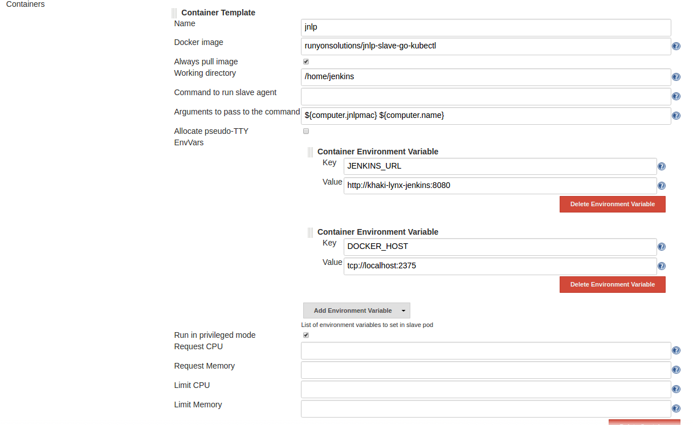
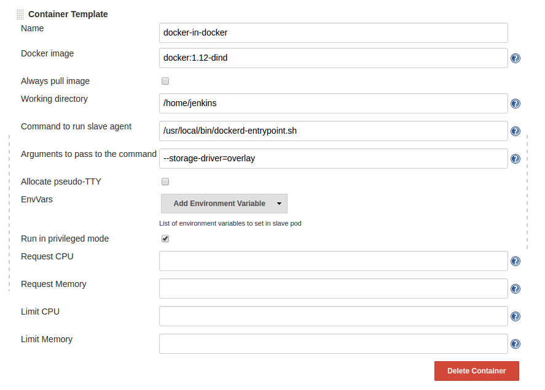
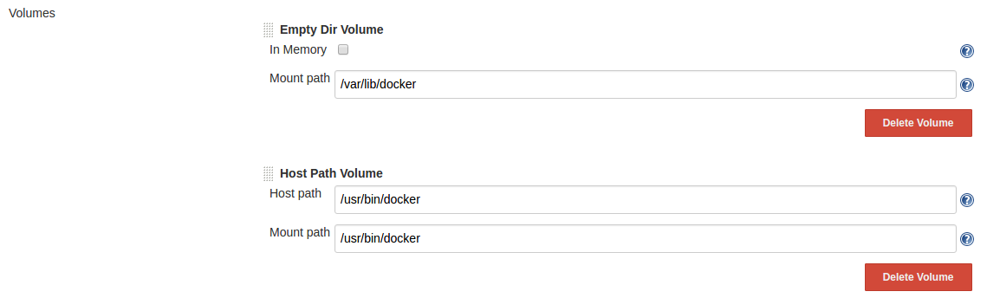
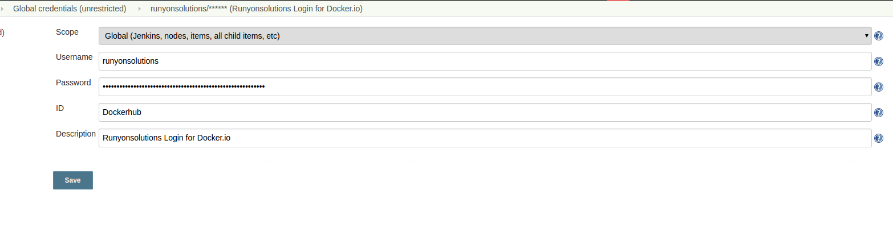
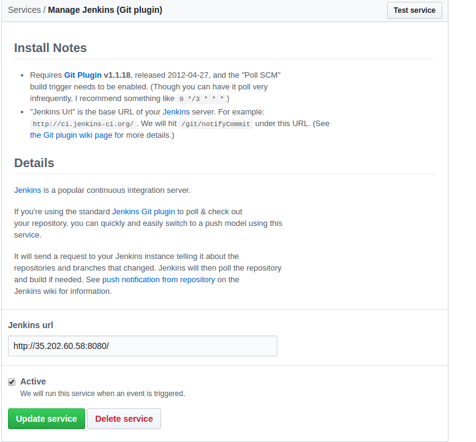
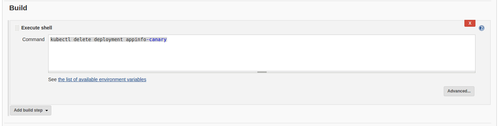
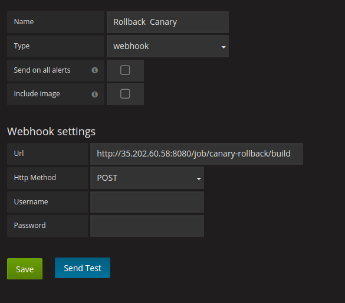

# Automated Canary Deployments


This tutorial looks to expand upon the tutorial in [runyontr/k8s-canary](http://github.com/runyontr/k8s-canary)
 and show how to automate the steps inside of a CICD pipeline. 
 
 
 
 
# Setup


# Deploy Infrastructure


```
helm install -f k8s/jenkins/values.yaml --name pretty-bird stable/jenkins
```


Get the login information for the admin password

```
printf $(kubectl get secret --namespace default pretty-bird-jenkins -o jsonpath="{.data.jenkins-admin-password}" | base64 --decode);echo
```

and the login address:
```
export SERVICE_IP=$(kubectl get svc --namespace default pretty-bird-jenkins --template "{{ range (index .status.loadBalancer.ingress 0) }}{{ . }}{{ end }}")
  echo http://$SERVICE_IP:8080/login
```


# Configure Jenkins

Navigate to  `Manage Jenkins -> Configure Systems` and ensure the following settings are present:








## Custom Jenkins-Slave image

This custom image is built from [this Dockerfile](jenkins/slave-image/Dockerfile) and has Golang 1.8 and
kubectl 1.8.0 pre-installed so it doesn't have to be installed fresh each run.

Talking to the Kubernetes cluster requires credentials that are provided to the pod as described
[Here](https://kubernetes.io/docs/concepts/configuration/secret/#service-accounts-automatically-create-and-attach-secrets-with-api-credentials).
  So no additional configuration is requried for authenticating to the kubernetes cluster.


## Explain docker in docker sidecar
 
 Thanks to @prydonius for this approach.  By adding the `docker:1.12-dind` container as a sidecar to the JNLP
  container, and mounting the docker executable from the kubernetes node, we are able to run docker commands
  inside of JNLP (namely `docker build` and `docker push`).
 

 
 
## Dockerhub Credentials

In order to push the image we build, we'll need to have our credentials available to the docker runtime
in the slave.  Create a credentials with your dockerhub login with ID 'Dockerhub' like this:



Dockerhub Credentials:

Add a username and password in the credential section with the dockerhub login with ID 'Dockerhub'.  Then we can use it
in the app's Jenkinsfile

```groovy
 docker.withRegistry('https://registry.hub.docker.com', 'Dockerhub') {
                app = docker.build("${image}:${tag}")
                app.push()
            }
```

For running this demo, you will need to create your own creditials in Jenkins and modify the image name in Jenkinsfile 
in the application folder


## Github Webhook

For this demo, we need to disable security on Jenkins to allow HTTP POST calls to start builds.   This will
be used for Grafana running builds to rollback the canary build when not performing well.

`Jenkins -> Manage Jenkins -> Configure Global Security`  and uncheck the `Enable Security` box.


# Create new Git Repo for application

Using Github (or other git provider) create a new git project for the application.  This documentation has the 
git project located at github.com/runyontr/canary-app, and this value should be adjusted to your particular 
remote.

In your github project, navigate to  `Settings -> Integration & services` add a new service for `Jenkins (git plugin)` and enter the Jenkins root URL
which can be found inside of Jenkins `Manage Jenkins -> Configure -> Jenkins Location -> Jenkins URL`.

Like so:




This will notify your Jenkins deployment that there was a change in the git repo and Jenkins will then
pull down the repo and look for changes.


# Create Jenkins Build

On the home page click `Create new job` and select multibranch pipeline with build name `appinfo`


In the git section, add a branch source by `Git`.  Enter the git repo in the Repository URL.


  The default is to just build on the master branch, we want to add
 another branch for `canary`.  Select `Add Branch` and populate the Branch Specifer with `*/canary`.
 
 Click Save.
 
 
 
# Initial push on master


Take the contents of the `app` folder in this git repo and push it on the master branch of the repo that was created

 


## Monitoring

Install Prometheus and Grafana via [Helm](https://helm.sh/).

```
helm install stable/prometheus --name prom
helm install stable/grafana --name graf --set server.service.type=LoadBalancer --set server.adminPassword=admin \
 --set server.image=grafana/grafana:4.5.1
```

As of writing this, [Issue 9777](https://github.com/grafana/grafana/issues/9777) prevents the latest Grafana image
 from properly firing alerts, so we hard code a previous version.


 Log into Grafana at the following address
 
 ```
 kubectl get svc graf-grafana
 ```
 with the username/password `admin/admin`.


After logging in, we need to add Prometheus as a data source:

Here are the config values that should be used:

```
Name: Prometheus
Type: Promethus

URL: http://prom-prometheus-server
Access: proxy
```


Click save and test and we should be good to go.


## Import Dashboard

Import the dashboard in the `grafana` folder [here](grafana/dashboard.json)


## Create Rollback Build

In jenkins, we need to make a new build that will rollback the canary deployment. 
 We create a new Freestyle
project with name `canary-rollback`, which has a single build step:




## Grafana Notifcation

Inside our grafana deployment at `/alerting/notifications`, we need to create a new notification Channel



The Dashboard that was imported should fire this notification when certain alerts are fired, causing the
Jenkins build to delete the canary deployment.


## View Dashboard

This dashboard has 3 graphs:

### AppInfo Response Time

This shows the 50th, 90th and 99th percentile response times for the stable and release deployments.

### Errors Per Second

This shows the number of errors per second being returned from the service.  In this basic demo this should never
be non-zero, but if the service starts spitting out errors in the canary deployment, the automatic rollback will
remove the canary deployment.

For example, if [line 77 in this file](app/appinfoservice.go) were uncommented. 


### Canary Response Times

This graph shows just the canary deployments response times.  Because of how Grafana works, we need a dedicated
graph that only shows the canary times to alert on.  This alert is configured to fire if the average response time
over the last 1 minute is greater than 2 seconds.  Additional alerts could be created for any SLOs on the system.


## Create Jenkins Job
Multibranch project

Screenshots of configuration


checkout app locally


Checkout branch `canary`

`cp -R ./app/* ../appinfo/`

Create commit and push up

(this would now be automated, but since I'm runnign jenkins locally, I'll)
Talk about manual running since Jenkins is all local right now, I'll manually run the check for new commits


# Before demo:

 Reset git repo
```
git checkout 7ec948e
git checkout -b temp
git branch -D master
git checkout -b master
git push origin master -f
git branch -D temp
```

Delete appinfo
```
kubectl delete deployment appinfo
kubectl delete deployment appinfo-canary
```


Watch terminals

`watch --color -d kubectl get pods -l app=appinfo`
`watch --color -d "http://104.154.230.2:8080/v1/appinfo | jq ."
`


# DEMO COMMANDS

```
cp -R ../k8s-automated-canary/app/* .
git add .
git commit -m "Initial app"
git push
```


```
git checkout -b canary
```

DO FIX

```
git add .
git commit -m "Added namespace value to response object"
git push origin canary
```

Show Grafana

Show slow canary


Show Unhealthy

Show build in Jenkins that was triggered

Show no more canary pod


FIX

git add .
git commit -m "Removed sleep"
git push origin canary


Show build

Show grafana/while has good values and response times look good


ISSUE PR

Merge PR (no sqaush, since that causes new build of canary branch)

Show
